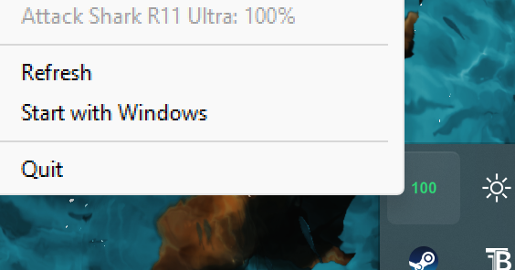

# R11 Ultra Battery Tracker

[](https://github.com/pixelinterest/AS-R11Ultra-Battery-Tray)
[](https://github.com/pixelinterest/AS-R11Ultra-Battery-Tray/releases/latest)
[](https://github.com/pixelinterest/AS-R11Ultra-Battery-Tray/releases)
[](https://www.rust-lang.org/)
[](./LICENSE)

Windows system tray battery monitor for the **Attack Shark R11 Ultra**.

**[Download latest release](https://github.com/pixelinterest/AS-R11Ultra-Battery-Tray/releases/latest)**



---

## Features

- Colored battery percent in the tray (green / orange / red; blue while charging)
- Same font size for 1–3 digit readings
- Runs in the background with no console window
- **Start with Windows** toggle (no admin required). Opening a newer build clears a stale startup entry — turn the option on again if you want it.
- Polls every 30s; keeps the last reading up to 5 minutes on a missed poll
- Supports 2.4 GHz dongle and USB-C charging
- Single native exe — no Python or PyInstaller

## Supported modes

| Mode | VID | PID |
|------|-----|-----|
| 2.4 GHz dongle | `0x3554` | `0xFB44` |
| USB-C wired | `0x3554` | `0xFB43` |

Bluetooth is not supported.

---

## Install

1. Download **R11UltraBattery-windows.zip** from [Releases](https://github.com/pixelinterest/AS-R11Ultra-Battery-Tray/releases/latest)
2. Extract and run `R11UltraBattery.exe`

## Build from source

Requires [Rust](https://rustup.rs/) and MSVC on Windows.

```powershell
cargo build --release
```

Output: `target\release\R11UltraBattery.exe`

## CLI

```powershell
R11UltraBattery.exe --once   # print battery to stdout
R11UltraBattery.exe --diag   # HID diagnostic dump
```

Tray colors: edit constants in [`src/icon.rs`](src/icon.rs). Protocol: [`protocol.md`](protocol.md).
